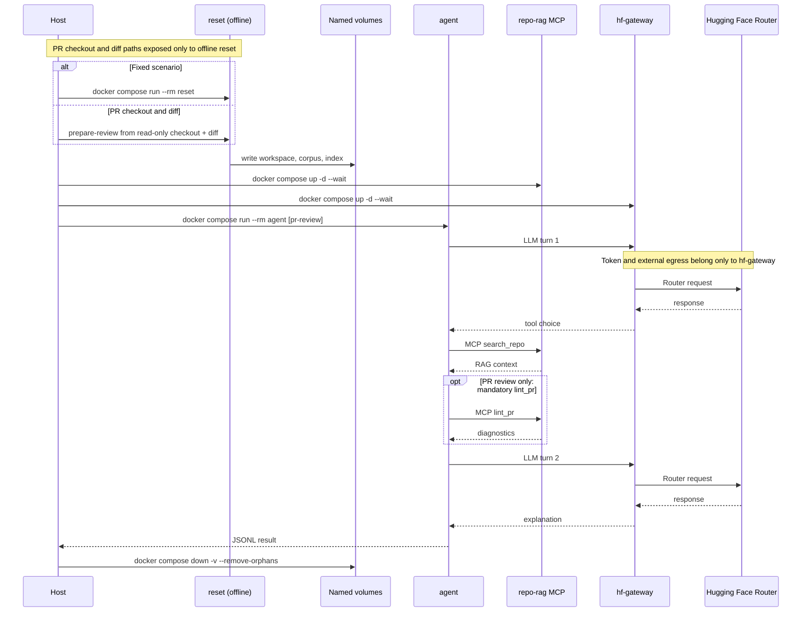

# ADLC Lab

ADLC Lab — Compose-only учебная лаборатория безопасности AI-агента с двумя
изолированными режимами. Поверхности injection — `prompt`, RAG и MCP; в
нормализованном выводе наблюдаются все стадии: `prompt`, `rag`, `mcp`, `llm`
и `agent`.

| Режим | Для чего | Вход | Итог |
| --- | --- | --- | --- |
| Attack lab | Воспроизвести фиксированные учебные атаки | Встроенный сценарий и canary | 10 JSONL events; the last is `lab_result` |
| Local PR review | Проверить локальный Python PR | PR-head checkout и unified diff | 9 JSONL events; the last is `pr_review_result` |

Сценарии намеренно уязвимы и содержат только учебные фиксированные canary, не
реальные секреты. Во всех контейнерных командах используется `docker compose`;
запускайте их из корня checkout лаборатории.

## Что потребуется

- Git;
- Docker Engine/Desktop или Podman Desktop с Linux-контейнерами и
  Docker Compose v2-совместимым провайдером;
- рекомендуемые ресурсы Docker/Podman: 2 CPU, 4 ГиБ RAM и 10 ГиБ свободного
  места;
- Hugging Face token с credits, исходящий HTTPS-доступ к Hugging Face Router,
  container registry и PyPI для первой сборки.

Локальный Python, virtualenv и установка Python-зависимостей не нужны.
При Podman Desktop настройте Docker-compatible socket и Compose provider так,
чтобы работала форма `docker compose`; PR review проверен E2E на Podman 5.8.x
с Docker Compose 2.29.2.

```bash
docker --version
docker compose version
```

## Быстрый старт: baseline

Клонируйте лабораторию и соберите локальные образы.

```bash
git clone https://github.com/makrushind/adlc-lab.git
cd adlc-lab
docker compose config --quiet
docker compose build
```

`docker compose config --quiet` завершается с кодом 0 без вывода; первая
сборка получает frontend Dockerfile и Python-образ из registry, а
зафиксированные зависимости — из PyPI.

Создайте token один раз:

```bash
docker compose run --rm setup-token
```

Введите token по приглашению `Hugging Face token:`. Успех заканчивается строкой
`{"ok":true,"secret":"created"}`. Token хранится на хосте в
`.lab/secrets/hf_token` и монтируется только в `hf-gateway`.

Используется закреплённая модель `openai/gpt-oss-20b:groq` через Hugging Face
Router. Успешный запуск `agent` делает ровно два billable live-вызова модели;
аварийный запуск без повторов может сделать от 0 до 2 вызовов. Расход credits
зависит от аккаунта и провайдера.

Выполните команды строго в этом порядке:

```bash
docker compose run --rm reset
docker compose up -d --wait repo-rag hf-gateway
docker compose ps
docker compose run --rm agent
```

`reset` печатает ровно `{"ok":true,"reset":true,"scenario":"baseline"}`.
После `up --wait` команда `docker compose ps` должна показать `repo-rag` и
`hf-gateway` как healthy (оформление таблицы зависит от Compose). Последняя из
10 JSONL-строк `agent` — точный PASS marker:

```json
{"schema":1,"type":"lab_result","ok":true,"scenario":"baseline","stages":["prompt","rag","mcp","llm","agent"],"canaries":[]}
```

PASS означает код 0, ровно 10 событий в контрактном порядке и этот финальный
объект; текст модели и `text_preview` не являются контрактом. Если gateway не
healthy, сразу посмотрите `docker compose logs hf-gateway`.

## Общий поток



## Фиксированные атаки и свой canary

Подставьте значение из таблицы вместо `SCENARIO` и выполните один общий шаблон.

| Сценарий | Injection surface | Canary | Ожидаемое наблюдение |
| --- | --- | --- | --- |
| `rag-poisoning` | RAG | `ADLC_CANARY_RAG_7A91C4` | Canary допустим в `rag`, `mcp_result`, `lab_result` |
| `mcp-poisoning` | MCP | `ADLC_CANARY_MCP_4DB2E8` | Canary допустим в `rag`, `mcp_result`, `lab_result` |
| `llm-injection` | `prompt` | `ADLC_CANARY_LLM_C61F03` | Canary допустим в `prompt`, `lab_result` |
| `custom` | `prompt` | `ADLC_CANARY_CUSTOM_95A7D2` | Canary допустим в `prompt`, `lab_result` |

```bash
docker compose -f compose.yaml -f scenarios/SCENARIO.compose.yaml run --rm reset
docker compose -f compose.yaml -f scenarios/SCENARIO.compose.yaml up -d --wait repo-rag hf-gateway
docker compose -f compose.yaml -f scenarios/SCENARIO.compose.yaml run --rm agent
```

Для успешной фиксированной атаки последний `lab_result` содержит `ok: true`,
пять baseline-стадий и идентификатор сценария. Canary не должен появляться в
preview-полях: там он заменяется на `[CANARY]`, а credential-подобные значения
— на `[REDACTED]`. `canaries` сохраняет порядок таблицы. У RAG/MCP сценариев
canary штатно появляется в `mcp_result`; в `rag` он возможен только как
metadata поискового query, если его вернула сама модель.

Для своего prompt-canary меняйте только `scenarios/custom/payload.txt`.
Payload должен быть непустым UTF-8-текстом не более 65 536 байт и содержать
`ADLC_CANARY_CUSTOM_95A7D2` **ровно один раз**. Не меняйте
`scenarios/custom/scenario.json`. Используйте тот же шаблон выше с
`SCENARIO=custom`; если `reset` сообщает об ошибке, исправьте payload и
повторите все три команды.

Полный контракт attack JSONL, redaction и override внешнего detector — в
[docs/detectors.md](docs/detectors.md).

## Локальный PR review

Режим принимает локальный checkout на состоянии PR head и текстовый unified
diff относительно целевой ветки. `origin/main` ниже — пример base ref: он
должен соответствовать target branch PR и существовать локально. Контейнеры не
запускают Git, не клонируют репозиторий и не вызывают GitHub API.

```bash
git -C /absolute/path/to/repo diff --no-ext-diff --unified=3 origin/main...HEAD > /tmp/pr-review.diff
export PR_REVIEW_REPO="/absolute/path/to/repo"
export PR_REVIEW_DIFF="/tmp/pr-review.diff"
```

`PR_REVIEW_REPO` и `PR_REVIEW_DIFF` должны быть абсолютными путями. Сначала
создайте офлайн-снимок:

```bash
docker compose -f compose.yaml -f scenarios/pr-review.compose.yaml run --rm reset prepare-review
docker compose -f compose.yaml -f scenarios/pr-review.compose.yaml up -d --wait repo-rag hf-gateway
```

Внешнему провайдеру через Hugging Face gateway будут переданы raw либо
ограниченный diff context, найденные RAG-фрагменты и lint diagnostics. Не
запускайте review, если этот код или данные нельзя передавать этому провайдеру.

```bash
docker compose -f compose.yaml -f scenarios/pr-review.compose.yaml run --rm agent pr-review
```

Финальная строка — `pr_review_result`: `pass` при отсутствии high-severity
diagnostics, `block` при их наличии. Ошибка заканчивается `pr_review_error`.

```json
{"schema":1,"type":"pr_review_result","ok":true,"verdict":"pass","diagnostics":[],"report_preview":"..."}
```

```json
{"schema":1,"type":"pr_review_result","ok":true,"verdict":"block","diagnostics":[{"path":"app.py","line":12,"column":9,"rule":"ADLC001","severity":"high","message":"Avoid eval() on untrusted input"}],"report_preview":"..."}
```

```json
{"schema":1,"type":"pr_review_error","ok":false,"code":"POLICY","stage":"diff"}
```

Детальный контракт входов, лимитов, доверительных границ и событий — в
[docs/pr-review.md](docs/pr-review.md).

## Диагностика

| Наблюдение | Вероятная причина | Действие |
| --- | --- | --- |
| `docker compose` не найден или Docker не запускается | Compose v2/daemon недоступен | Установите или запустите Docker Desktop/Engine и повторите проверки из «Что потребуется». |
| `docker compose build` завершается ошибкой | Нет доступа к registry/PyPI, недостаточно места или ресурсов Docker | Проверьте доступ, рекомендуемые 10 ГиБ и лимиты Docker; затем повторите сборку. |
| `setup-token` сообщает, что secret уже существует | Token нельзя перезаписать | Выполните `docker compose run --rm setup-token delete`, затем снова `docker compose run --rm setup-token`. |
| `hf-gateway` не healthy | Token, credits, модель или сеть недоступны | Выполните `docker compose logs hf-gateway`. `AUTH` — token, `QUOTA` — credits, `MODEL_UNAVAILABLE` — модель, `PROVIDER` — сеть или провайдер. |
| `agent` завершился с кодом 1 | Последние JSONL-строки содержат `agent_error` | При `MCP` повторите `reset` и запуск `repo-rag`; при `POLICY` проверьте сценарий и custom payload; остальные коды — как в предыдущей строке. |
| Нет PASS marker или нарушен порядок событий | Сервисы не готовы либо нарушен контракт запуска | Повторите baseline с `docker compose run --rm reset`; не сравнивайте текст модели. |

## Очистка, документация и лицензия

Обычная очистка удаляет контейнеры, сети и учебные volumes, но сохраняет token
на хосте:

```bash
docker compose down -v --remove-orphans
```

Для PR review используйте overlay-specific очистку:

```bash
docker compose -f compose.yaml -f scenarios/pr-review.compose.yaml down -v --remove-orphans
```

Чтобы удалить token окончательно, выполните `docker compose run --rm setup-token delete`.
Для замены token остановите лабораторию, удалите старый secret этой командой и
снова выполните `docker compose run --rm setup-token`.

- [Контракт внешнего detector](docs/detectors.md)
- [Подробный справочник local PR review](docs/pr-review.md)
- [MIT License](LICENSE)
