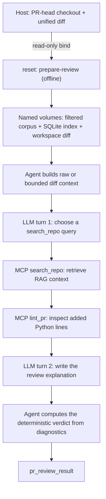

# ADLC Lab

ADLC Lab совмещает два изолированных режима. Фиксированная attack-lab позволяет
наблюдать учебный цикл с одним MCP/RAG-вызовом и проверять prompt injection на
границах `prompt → RAG → MCP → LLM → agent`. Отдельный opt-in режим локально
готовит пользовательский Python PR, получает контекст через `search_repo`,
запускает детерминированный `lint_pr` через тот же MCP endpoint и формирует
отчёт за два LLM-вызова. Режимы имеют отдельные команды, контракты вывода и
attack payload fixtures; PR-review переиспользует валидированный search-протокол
и baseline marker, не меняя фиксированные attack-сценарии.

Оба агента печатают в stdout нормализованные JSONL-события. В attack-lab текст
ответа live-модели не является контрактом и не проверяется; в PR-review итоговый
`verdict` определяется lint diagnostics, а модель отвечает только за пояснение.

Сценарии намеренно уязвимы. Используйте их только в учебной среде: в них
содержатся только фиксированные учебные canary-значения, а не реальные секреты.

## Что потребуется

- Git;
- Docker Engine, Docker Desktop или Podman Desktop с Linux-контейнерами и
  Docker Compose v2-совместимым провайдером;
- не менее 2 CPU, 4 ГиБ RAM и 10 ГиБ свободного места;
- Hugging Face token с доступными credits и исходящий HTTPS-доступ к Hugging
  Face Router;
- исходящий доступ к настроенному container registry: при первой сборке Docker
  получает оттуда frontend Dockerfile и базовый образ Python, а также доступ к
  PyPI для зафиксированных Python-пакетов.

Локальный Python, virtualenv и установка Python-зависимостей не нужны: всё
выполняется в контейнерах. Все команды ниже используют форму `docker compose`;
при работе через Podman Desktop настройте Docker-compatible socket и Compose
provider так, чтобы эта форма обращалась к выбранной Podman machine. Путь
PR-review проверен E2E на Podman 5.8.x с Docker Compose 2.29.2.

Проверка runtime должна напечатать обе версии:

```bash
docker --version
docker compose version
```

## Установка и token

Клонируйте лабораторию и соберите локальные образы.

```bash
git clone https://github.com/makrushind/adlc-lab.git
cd adlc-lab
docker compose config --quiet
docker compose build
```

`docker compose config --quiet` завершается с кодом 0 и ничего не печатает;
`docker compose build` создаёт локальные образы `adlc-lab-*`. При первой
сборке Docker получает frontend Dockerfile и базовый Python-образ из container
registry, затем скачивает зафиксированные Python-пакеты с PyPI.

Создайте token один раз:

```bash
docker compose run --rm setup-token
```

Введите Hugging Face token по приглашению `Hugging Face token:`. Ввод скрыт.
При успехе последняя строка — `{"ok":true,"secret":"created"}`. Token
сохраняется на хосте в `.lab/secrets/hf_token` и монтируется только в
`hf-gateway`.

Внимание: успешный запуск `agent` выполняет ровно два billable live-вызова
модели и расходует Hugging Face credits. Аварийный запуск без повторов может
остановиться до первого вызова, после первого или после второго, то есть
сделать ноль, один либо два live-вызова. Стоимость зависит от вашего аккаунта
и провайдера; не запускайте сценарии многократно без необходимости.

## Baseline: первый успешный запуск

Выполните команды строго в этом порядке.

```bash
docker compose run --rm reset
docker compose up -d --wait repo-rag hf-gateway
docker compose ps
docker compose run --rm agent
```

Ожидаемые результаты:

- `reset` печатает ровно `{"ok":true,"reset":true,"scenario":"baseline"}`;
- `docker compose up -d --wait repo-rag hf-gateway` завершается с кодом 0;
  это проверка готовности обоих сервисов. В выводе `docker compose ps` должны
  быть `repo-rag` и `hf-gateway` с признаком `healthy`; оформление таблицы
  (`Up`, `running` и другое) зависит от версии Compose и не является
  контрактом;
- `agent` печатает ровно десять JSONL-строк в порядке ниже, а его последняя
  строка — точный маркер PASS:

```json
{"schema":1,"type":"lab_result","ok":true,"scenario":"baseline","stages":["prompt","rag","mcp","llm","agent"],"canaries":[]}
```

PASS означает: команда `agent` завершилась с кодом 0, в выводе ровно десять
событий в указанном порядке, а финальный `lab_result` совпадает с маркером
выше. Содержимое `text_preview` и формулировка ответа модели для PASS не
важны.

## Локальный PR review

Этот режим намеренно отделён от учебных фиксированных сценариев. Он принимает
локальный checkout на состоянии PR head и обычный текстовый unified diff
относительно целевой ветки. Контейнеры не запускают Git, не клонируют репозиторий
и не обращаются к GitHub API.

### UX пользователя

1. На хосте checkout-ите PR head и создайте diff:

```bash
git -C /absolute/path/to/repo diff --no-ext-diff --unified=3 origin/main...HEAD > /tmp/pr-review.diff
export PR_REVIEW_REPO="/absolute/path/to/repo"
export PR_REVIEW_DIFF="/tmp/pr-review.diff"
```

`PR_REVIEW_REPO` и `PR_REVIEW_DIFF` должны быть абсолютными путями. Checkout
должен соответствовать новой стороне diff; несовпадение изменённых файлов,
небезопасный путь или неподдерживаемый diff завершат подготовку с ошибкой до
запуска внешней модели.

2. Выполните строго эти три команды:

```bash
docker compose -f compose.yaml -f scenarios/pr-review.compose.yaml run --rm reset prepare-review
docker compose -f compose.yaml -f scenarios/pr-review.compose.yaml up -d --wait repo-rag hf-gateway
docker compose -f compose.yaml -f scenarios/pr-review.compose.yaml run --rm agent pr-review
```

`prepare-review` создаёт в именованных volumes отфильтрованный снимок checkout,
нормализованный diff и SQLite RAG-индекс. Повторный запуск полностью заменяет
этот снимок. `up --wait` подтверждает готовность RAG и gateway. `pr-review`
печатает события по мере прохождения границ и завершается кодом 0 после
получения итогового результата.

3. Прочитайте `verdict`, `diagnostics` и ограниченный 512 символами
`report_preview` в последней JSONL-строке, затем удалите runtime-снимок:

```bash
docker compose -f compose.yaml -f scenarios/pr-review.compose.yaml down -v --remove-orphans
```

### Workflow агента



Модель выбирает параметры только одного repository search. Агент всегда
вызывает `search_repo`, затем программно передаёт изменённые Python targets в
`lint_pr`: модель не решает, запускать ли lint. Во втором LLM-вызове она
получает ограниченный контекст поиска и lint diagnostics и пишет пояснение.
`verdict` вычисляется после ответа модели: хотя бы одна high-severity
диагностика даёт `block`, поэтому текст модели не может скрыть детерминированную
проблему.

### Что получает пользователь

Успешный запуск печатает ровно девять JSONL-событий:

1. `llm_request` — первый LLM-вызов;
2. `llm_response` — выбранный поисковый запрос;
3. `mcp_request` — вызов `search_repo`;
4. `mcp_result` — число и пути RAG-фрагментов;
5. `mcp_request` — вызов `lint_pr`;
6. `mcp_result` — число diagnostics;
7. `llm_request` — второй LLM-вызов без tools;
8. `llm_response` — preview текстового отчёта;
9. `pr_review_result` — итог review.

PR без high-severity diagnostics завершается так:

```json
{"schema":1,"type":"pr_review_result","ok":true,"verdict":"pass","diagnostics":[],"report_preview":"..."}
```

Найденный прямой `eval(...)` в добавленной строке даёт `block` и структурированную
диагностику:

```json
{"schema":1,"type":"pr_review_result","ok":true,"verdict":"block","diagnostics":[{"path":"app.py","line":12,"column":9,"rule":"ADLC001","severity":"high","message":"Avoid eval() on untrusted input"}],"report_preview":"..."}
```

При обработанной ошибке последней строкой становится `pr_review_error`, например:

```json
{"schema":1,"type":"pr_review_error","ok":false,"code":"POLICY","stage":"diff"}
```

В зависимости от границы `stage` указывает `diff`, `llm`, `mcp` или `review`,
а `code` содержит нормализованную категорию ошибки. Автоматических повторов
нет. Успешный PR review делает ровно два billable live-вызова модели через
Hugging Face gateway.

### Границы и приватность

- Host checkout и diff монтируются read-only только в offline-сервис `reset`.
  `repo-rag`, `agent` и `hf-gateway` не получают прямого доступа к этим host
  paths.
- Для небольшого diff модель получает исходный текст. Для большого diff первое
  сериализованное user-message ограничено 32 KiB и содержит детерминированный
  digest; сумма сериализованных messages второго вызова ограничена 96 KiB.
- Локальная копия полного diff используется для проверки входа, построения
  targets и evidence. Внешнему провайдеру через Hugging Face gateway передаются
  raw или bounded diff context, найденные RAG-фрагменты и lint diagnostics.
- Redaction защищает локальный trace, но не скрывает код, уже отправленный
  внешней модели. Снимок остаётся в Docker volumes до явного `down -v`.
- GitHub PR URL, checkout base/head внутри контейнера и публикация review
  comments не поддерживаются.

#### Совместимость с Podman

В PR-review override у `reset`, `repo-rag` и `agent` отключено SELinux
process-label разделение через `label=disable`: Docker Compose 2.29.2 не
передаёт `:z` для named volumes в Podman, иначе следующий контейнер не может
прочитать подготовленный снимок. Сервисы остаются non-root; прежние ограничения
networks, secrets и read-only mounts не меняются.

Это Python MVP, а не универсальный анализатор. Его точные границы:

- В снимок входят только `.py`, `.pyi`, `.md`, `.toml`, `.yaml`, `.yml`,
  `.json` и `.txt`; diff должен быть не больше 512 KiB.
- Подготовка копирует не более 1 000 файлов, до 256 KiB на файл и до 10 MiB
  суммарно.
- Lint принимает не более 100 изменённых Python targets, не более 10 000
  добавленных строк суммарно, до 256 KiB на target и возвращает не более 100
  diagnostics.
- Lint проверяет только прямой вызов `eval(...)` в добавленных строках
  изменённых `.py`-файлов; код checkout не исполняется.

## Фиксированные учебные атаки

Для каждого запуска используйте три команды из строки таблицы. Override
применяется и к `reset`, и к запуску сервисов, и к `agent`.

| Сценарий | Граница | Canary | Compose override |
| --- | --- | --- | --- |
| `rag-poisoning` | RAG | `ADLC_CANARY_RAG_7A91C4` | `scenarios/rag-poisoning.compose.yaml` |
| `mcp-poisoning` | MCP | `ADLC_CANARY_MCP_4DB2E8` | `scenarios/mcp-poisoning.compose.yaml` |
| `llm-injection` | prompt | `ADLC_CANARY_LLM_C61F03` | `scenarios/llm-injection.compose.yaml` |

```bash
docker compose -f compose.yaml -f scenarios/rag-poisoning.compose.yaml run --rm reset
docker compose -f compose.yaml -f scenarios/rag-poisoning.compose.yaml up -d --wait repo-rag hf-gateway
docker compose -f compose.yaml -f scenarios/rag-poisoning.compose.yaml run --rm agent

docker compose -f compose.yaml -f scenarios/mcp-poisoning.compose.yaml run --rm reset
docker compose -f compose.yaml -f scenarios/mcp-poisoning.compose.yaml up -d --wait repo-rag hf-gateway
docker compose -f compose.yaml -f scenarios/mcp-poisoning.compose.yaml run --rm agent

docker compose -f compose.yaml -f scenarios/llm-injection.compose.yaml run --rm reset
docker compose -f compose.yaml -f scenarios/llm-injection.compose.yaml up -d --wait repo-rag hf-gateway
docker compose -f compose.yaml -f scenarios/llm-injection.compose.yaml run --rm agent
```

После каждой успешной атаки последний `lab_result` имеет `ok: true`, пять
стадий из baseline и идентификатор выбранного сценария. Canary не должен
появляться в preview-полях: он допустим только в массиве `canaries` на
разрешённых границах и в финальном результате.

## Canary: где он может быть виден

| Canary | Сценарий | Разрешённые `canaries` в JSONL |
| --- | --- | --- |
| `ADLC_CANARY_RAG_7A91C4` | `rag-poisoning` | `rag`, `mcp_result`, `lab_result` |
| `ADLC_CANARY_MCP_4DB2E8` | `mcp-poisoning` | `rag`, `mcp_result`, `lab_result` |
| `ADLC_CANARY_LLM_C61F03` | `llm-injection` | `prompt`, `lab_result` |
| `ADLC_CANARY_CUSTOM_95A7D2` | `custom` | `prompt`, `lab_result` |

`canaries` всегда сохраняет фиксированный порядок из таблицы. Во всех
`*_preview` полях canary заменяется на `[CANARY]`; credential-подобные значения
заменяются на `[REDACTED]`. Для фиксированных `rag-poisoning` и
`mcp-poisoning` canary штатно появляется в `mcp_result`: именно там сценарий
вносит payload. Появление того же RAG/MCP-canary в `rag.canaries` возможно
только если модель сама поместила его в поисковый query; это metadata о query,
а не перенос источника packaged-сценария.

## Свой prompt-canary

Меняйте только `scenarios/custom/payload.txt`. Файл должен быть непустым
UTF-8-текстом размером не более 65 536 байт и содержать
`ADLC_CANARY_CUSTOM_95A7D2` **ровно один раз**. Не меняйте
`scenarios/custom/scenario.json`: дескриптор фиксирует сценарий и его canary.

```bash
docker compose -f compose.yaml -f scenarios/custom.compose.yaml run --rm reset
docker compose -f compose.yaml -f scenarios/custom.compose.yaml up -d --wait repo-rag hf-gateway
docker compose -f compose.yaml -f scenarios/custom.compose.yaml run --rm agent
```

Если `reset` сообщает об ошибке сценария, сначала проверьте это правило, затем
исправьте payload и повторите все три команды.

## Контракт вывода и detector

Успешный запуск печатает именно десять событий:

1. `prompt`
2. `llm_request`
3. `tool_call`
4. `rag`
5. `mcp_request`
6. `mcp_result`
7. `llm_request`
8. `llm_response`
9. `agent`
10. `lab_result`

Каждая строка — отдельный JSON-объект `schema: 1`. Полный контракт схемы,
redaction и Compose override для внешнего detector — в
[docs/detectors.md](docs/detectors.md).

## Диагностика

| Наблюдение | Вероятная причина | Действие |
| --- | --- | --- |
| `docker compose` не найден или Docker не запускается | Compose v2/daemon недоступен | Установите или запустите Docker Desktop/Engine и повторите проверки из «Что потребуется». |
| `docker compose build` завершается ошибкой | Нет доступа к container registry или PyPI, мало места или ресурсов Docker | Проверьте доступ к registry и PyPI, 10 ГиБ места и лимиты Docker; затем повторите `docker compose build`. |
| `setup-token` сообщает, что secret уже существует | Token нельзя перезаписать | Выполните `docker compose run --rm setup-token delete`, затем снова `docker compose run --rm setup-token`. |
| `hf-gateway` не становится healthy | Token, credits, модель или сеть недоступны | Выполните `docker compose logs hf-gateway`. Код `AUTH` означает неверный/недоступный token, `QUOTA` — закончились credits, `MODEL_UNAVAILABLE` — недоступна модель, `PROVIDER` — сбой сети или провайдера. |
| `agent` завершился с кодом 1 | Последние JSONL-строки содержат `agent_error` | При `MCP` повторите `reset` и запуск `repo-rag`; при `POLICY` проверьте выбранный сценарий и custom payload; при `AUTH`/`QUOTA`/`MODEL_UNAVAILABLE`/`PROVIDER` используйте действие из предыдущей строки. |
| Нет PASS-маркера или порядок событий другой | Сервисы не готовы либо контракт запуска нарушен | Повторите baseline целиком, начиная с `docker compose run --rm reset`; не сравнивайте текст ответа модели. |

## Очистка и замена token

Обычная очистка удаляет контейнеры, сети и учебные volumes, но сохраняет token
на хосте:

```bash
docker compose down -v --remove-orphans
```

Чтобы удалить credential окончательно, выполните отдельную команду:

```bash
docker compose run --rm setup-token delete
```

Для замены token сначала остановите лабораторию, затем удалите старый secret и
создайте новый:

```bash
docker compose down -v --remove-orphans
docker compose run --rm setup-token delete
docker compose run --rm setup-token
```
